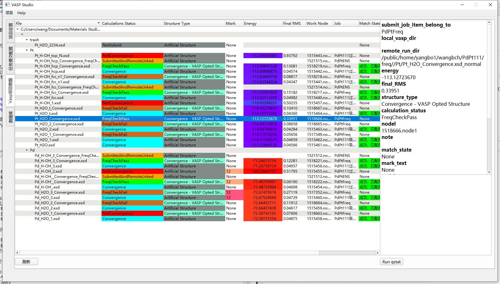
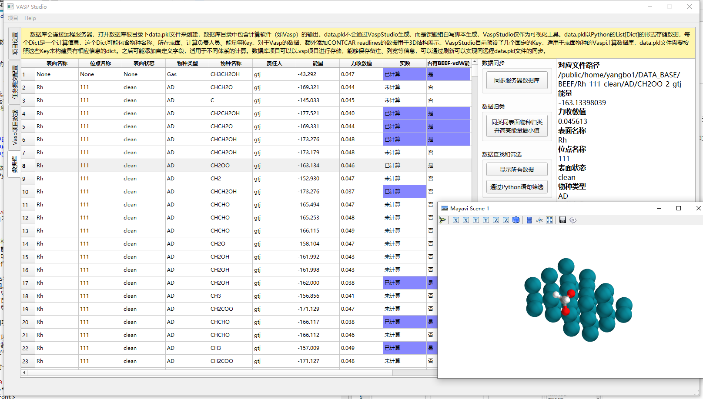

# VaspStudio
## 简介
Vasp任务提交和管理、数据提取和结构可视化软件  
功能：  
- 以Material Studio的.xsd文件建立项目，配置Vasp任务提交文件，自动转POSCAR，自动批量配置和生成INCAR，KPOINTS等文件，自动ssh登录，sftp上传，运行超算任务提交脚本  
- 无需下载OUTCAR等，远程直接提取能量、频率和优化RMS数值，快速查看CONTCAR输出结构，导出优化结构到原始.xsd文件，无缝实现连续任务提交  
- 丰富的文件Mark系统，包括是否收敛，是否有虚频，支持自定义标记  
- 支持打开超算Vasp运行嵌套目录，对每个Vasp计算结果文件夹进行信息提取
- 简单的数据库功能
- 更多功能查看使用教程和更新日志

## 软件截图

## 安装
不提供编译的exe文件版本，而是提供一个能够运行VaspStudio中Python文件的完整Python环境。下载release中的VaspStudioRuntimePythonEnv，放入根目录，运行runVaspStudio.bat
# 功能简述和更新日志 
## 2019年12月14日 v0.3-preview
### 功能
- 打包所有源代码文件，优化目录结构
- 增加wxDragon打开OUTCAR文件（需要将wxDragon放入运行环境中wxDragon文件夹下）
- 美化UI
- 增加导出CONTCAR结构到xsd文件功能，无需本地xsd文件
- 增加简单的数据库功能，从规定了Key的data.pkl文件中读取信息建立数据库，具备分子绘制，简单的搜索等功能
- 增加从远程目录建立项目的功能，会将同时有OUTCAR，CONTCAR和POSCAR的文件夹作为一个项目
- 增加本地项目通过文件路径和远程服务器项目关联，任务提交后自动关联，修改本地关联和远程关联相关状态，推荐优先使用远程关联避免下载Vasp输出文件夹
- 本地和远程能量、RMS和频率信息改为同时提取，status优先由虚频是否数量合理决定，其次是RMS是否收敛。 远程提取能量RMS和频率通过下载OUTCAR读取再删除实现，将CONTCAR和POSCAR缓存用于结构展示
- 增加配置文件导入和导出功能，同时在Resource文件夹中增加了示例和模板配置
- 增加右键打开本地项目（.xsd文件）所在文件夹的功能
- 增加能量色阶，结构导出Match State的颜色
- UI界面优化
- 优化分子3D结构绘制功能
### 开发相关
- 对项目文件进行了整理，如.ui放入UI文件夹，脚本放入script等，将与数据提取相关的放入VaspDataTools中，工具放入utils中
- 将重复调用的代码封装成函数精简，大量增加类型声明，将from XXX import XXX全部改为import XXX as
- 取消pyinstaller安装，直接放一个可用的安装好所有所需模块的Python在根目录然后使用一个脚本来运行
### debug
- 优化大量item选择时卡顿的问题：由提取所有选择item的信息改为只提取所选第一个item的信息

## 2018年12月6日 v0.22
- **更新到master，原v0.21版本在branch：[v0.21-stable](https://github.com/B-C-WANG/VaspStudio/tree/v0.21-stable)**
- 增加了使用mayavi进行分子绘制的功能，双击某列即可看到原子结构
- 将Project Information 更新为Settings，并可以在Settings处通过修改文本文件更改分子绘制的参数
## 2018年11月23日 v0.21
- 增加文件树折叠存储
- 修改收敛的导出结构的颜色，避免和收敛状态颜色相同
- 减少了不必要的窗口弹出
- Job Config新增复制功能
## 2018年9月23日 v0.201
- 从VASP提取能量对于某些情况下会出现错误，主要是energy without entropy的定位问题 
## 2018年6月30日
- 更新中英文文档
## 2018年6月24日 v0.2
- 项目从DFT_Calc/pyqt5program/AUTOVASP中公开，版本v0.2，增加GUI。
## 2018年5月前 v0.1
- 无GUI界面的任务提交脚本
