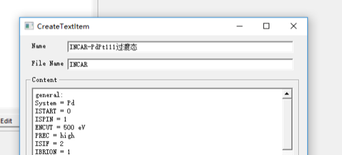
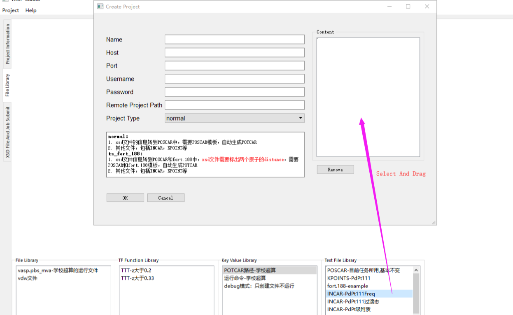

# 使用教程
这里的使用教程已经包括UserGuideV0.2.pdf的内容（仅中文版）
## 注意事项和建议
- 目前只支持从Material Studio的.xsd文件导出POSCAR结构
- 建议VaspStudio本地项目目录和Material Studio的Documents共享同一目录，与远程指定目录一一对应
- 随时使用Ctrl+S进行项目保存

## 1 从本地建立项目和提交Vasp任务流程
### 1.1 创建或打开项目
点击菜单栏的新建项目，选择一个顶端文件夹，这个文件夹移动可能导致项目不可用，因此建议选择长时间存储.xsd文件的目录，例如Material Studio项目的Documents目录。创建过后会立即要求给出一个路径来保存项目文件(.vsp)，之后打开本项目需要这个文件
### 1.2 文件更新
建立或打开项目后，会检测文件改动（新文件或者删除的文件），同时会提示不兼容Linux系统的文件命名，需要进行改名。左侧第三个选项卡点开可以看到所有.xsd的文件树，每个.xsd文件作为一行，可以存储Vasp计算结果的能量、收敛情况等信息，或者用于分子绘制
    
点击左下角的刷新按钮也可以实现手动刷新，比如在删除或者重命名了.xsd文件后，这里会自动删除和创建项目
### 1.3 准备任务提交库
**在VaspStudio项目的Resource文件夹中有模板和示例配置，模板配置是基本上都需要用到的，导入后根据情况加以修改，而示例不是必须的，只是提示应该创建哪些文件，要根据具体情况创建**  
库分为文本文件库，按路径文件库，是否Fix的判断函数库，以及键-值对库。每个库的每个项目都有一个名称显示，这个名称不能重复。    
对于每个.xsd文件，提交任务过后，文本文件会创建成固定名称放入根目录，按路径文件会直接复制上传，Fix的判断函数用于POSCAR中设定坐标后是否Fix的TTT或FFF，键-值对用于零散的配置（之后有具体例子） 
#### 1.3.1 创建文本文件库
点击创建按钮后，弹出窗口会要求设置Name，File Name和Content，Name是用于便于记忆的，注意所有库的Name不能重复，重复会有提示。File Name是所创建的文本文件的名称，Content为其内容，投Job的时候会创建这个为了将，下面是一个创建INCAR的例子：  
  
Name可以随意取，代表不同的INCAR，但是File Name必须是INCAR，因为之后提交任务就会用这个文件名。  
KPOINTS文件也可以这样直接创建。  
一般POSCAR是变动的没办法创建，但是由于本软件会提供结构提取的功能，因此这里要求创建一个带有占位符的POSCAR文件：
  
内容是：  
whatwhatwhat  
1.00000000000000  
\<lattice\_vector\>  
\<atom\_info\>  
Selective dynamics  
Direct  
\<pos\_info\>  
\<\>中的内容会被从.xsd文件中提取的内容替代  
同样，如果有过渡态，且使用fort188来运行，则需要如下类似创建：
  
#### 1.3.2 创建按路径文件库
某些文件需要放到原封不动放到目录下的，就使用按路径文件库，首先需要下载文件到本地，然后设置Name和对应的路径即可。一般是二进制文件和linxu下的.sh脚本文件（脚本文件虽然是文本，但是创建成文本文件库可能因为Windows文本文件与Linux不兼容导致错误）
#### 1.3.3 创建是否Fix判断函数库
POSCAR中有TTT FFF的设置，比如Fix掉底层原子。这里设置的函数通过坐标逻辑判断是否进行Fix，会迭代判断所有原子。如下所示：  
  
所有原子有x y z坐标，这里写入z>0.2也就是将z坐标大于0.2的变为TTT，然后下面X,Y,Z输入框可以用逗号分隔输入一个原子的坐标，点击Test可以测试将会被判断为TTT还是FFF，然后点击Create创建
#### 1.3.4 创建键-值对
键值对主要是处于扩展性的考虑，比如POTCAR的路径，完全可以在项目创建时要求给出，但是这样的话，如果有些项目使用不同的POTCAR路径，就没法更改了，因此这些设置通过键值对进行，对于Vasp计算，有两个**必填**内容：  
第一个是POTCAR路径：  
    
POTCAR会直接拿该目录下和原子名称相同的，比如POSCAR中包含Cu，O，就按照顺序拿Value目录下Cu，O的POTCAR（如果不是拿和原子名称相同的，而是有后缀的，比如Cu\_sv，则需要设置键值对POTCAR\_suffix为\_sv）  
第二个是脚本运行命令  
    
在按路径文件库中比如我们创建了vasp.pbs\_mva，如何进行运行，就在这里设置，直接运行就是sh vasp.pbs\_mva，任务提交就是qsub XXX  
其他键值对：PORCAR后缀POTCAR\_suffix，debug模式等

#### 1.3.5 创建任务提交配置
到这里我们创建完成了所有Vasp任务所需的东西（如下图）  
    
但是没有设置远程服务器的路径，也没有把这些所需的库组合，此时就通过创建任务提交配置文件进行
    
在这里，我们把一个任务所需的所有库从下面拖动上去，比如拖动INCAR，POSCAR就是在提交时上传这些文件，拖动键值对库就是设置相应的POTCAR路径等  
Host、Port、Username和 Password都是ssh和sftp登录的必要信息，Remote Project Path是服务器上创建VASP文件夹的顶端文件夹，之后所有任务会按照其相对于本地的路径嵌套地创建在这里面。不同的任务需要创建不同的配置文件（只要它们所需的INCAR等文件不同），因此每种任务单独给一个空文件夹，比如过渡态为vsJob/TS/，频率为vsJob/Freq/等，否则可能出现同名覆盖现象。Project Type大部分情况是normal，除了过渡态是fort.188。    

某个任务提交的配置的库为：  
    
通过库的排列组合来构建任务提交配置，能够创建不同任务或者是提交到不同超算服务器上的配置。
#### 1.3.6 任务配置的导入导出
- 任务配置区域上面的按钮可以导入\导出配置文件，在Vasp Studio项目根目录下的Resource文件夹中有一些常用到的标准配置可以导入。注意导入时，配置文件中的命名不能和现有命名重复。

### 1.4 批量任务提交
在文件树的地方，选择（支持ctrl+A全选，shift点选等）你需要提交的.xsd结构文件右键选择提交任务，此时会要求选择一个任务提交配置，确认后进行提交，此时需要等待直到更新，完成提交后会显示qstat对应的节点名称（只支持qsub运行的任务），如下：  
    
注意此列在较后面，需要拖动前面几列才能看到。  
简述一下任务提交后会发生什么：所有.xsd文件会按照相对于本地路径一模一样的嵌套路径上传到服务器，文本文件创建上传，按路径文件复制上传，然后TF condition和键值对写入json文件上传，上传过后服务器上本软件的submit\_job\_on\_server.py文件会读取json文件，提取xsd结构到POSCAR，给出TTT FFF，然后准备完成所有文件后运行命令，提交结果以json写入IO temp等临时文件，再下载下来更新信息  
### 1.5 提交过渡态额外事项
对于使用fort.188方法搜索过渡态的任务，除了配置fort.188文件以外，还要求通过Material Studio标出成键断键的两个原子，如下图：
    
不能够多标或者少标

## 2 任务关联和运行结果信息提取
### 2.1 文件树窗口介绍
窗口类似一个Excel表格，上面的列宽和列的顺序可以调整，点击可以排序。选中一个项目，右上角会显示项目所有的详细信息。
### 2.2 任务状态与关联
Calculation Status有NotSubmitted，Linked，NotConvergence和Convergence等，未提交的任务是NotSubmitted。对于v0.3以前的版本，任务提交过后显示Submitted，对于v0.3之后的，会自动关联任务提交对应的服务器上的Vasp输出文件夹。文件关联可以通过服务器远程关联和本地关联两种方式，v0.3的之前的项目可以通过远程关联的方式给出当初投任务所用的配置补充远程关联（v0.3之后的一般无需再进行远程关联）。
#### 2.2.1 根据路径本地关联（目前不推荐）
由于提交任务的时候，提交上去是保留了嵌套结构，同时文件名也是和.xsd文件名相同的，因此可以通过路径检测关联。本地关联（通过路径）是将Vasp计算的文件夹从设置的远程项目根目录保持嵌套结构下载下来进行关联。关联时需要选择下载下来的文件夹的根目录。比如现在一个
xsd的树状路径在\<项目路径\>/Pd111/trans/C-1.xsd，对应的服务器VASP文件夹是vsJob/Pd111/trans/C-1.xsd，那么就把vsJob整个文件夹下载到本地，然后选中所在文件夹进行关联。
#### 2.2.2 根据路径远程关联
如果是v0.3以前的软件，是不会自动远程关联的，所以要补充关联，只需要给出当时投任务所用的配置进行关联即可（每个项目会记录当时提交任务所用配置的名称），如果忘记了没有关系，可以只要设置正确服务器地址和远程项目根目录即可尝试关联。比如本地有文件A/B/C/Data/1.xsd，项目目录是A/B，那么相对目录就是C/Data/1.xsd，如果远程服务器有AA/BB/C/Data/1.xsd，则创建一个远程项目目录为AA/BB的任务提交配置再关联即可。
### 2.3 运行结果信息与状态
#### 2.3.1 导出结构和结构类型（Structure Type）
**只有关联过后的本地.xsd文件的项目才能导出结构到新.xsd文件(没有本地.xsd文件的项目，如从远程目录创建的项目不能导出)**，用于实现无缝的下一进度任务提交（比如优化完成的结构算频率），导出的算法原理：将原始.xsd文件和POSCAR对照，确定原子，然后把坐标从POSCAR的坐标修改到CONTCAR的坐标，实现原地.xsd文件导出。  
导出后会根据POSCAR和原始.xsd原子对应的数目给出**Match State，Match State小于1的话可以被认为是导出失败**    
导出的结构有时候键可能不正确，如：
    
但只要位置正确即可，可以通过delete bonds然后 Monitor bonding重新构建  
结构类型用于区分是原始的.xsd文件，还是是从Vasp已经优化的最后一步结构导出的.xsd文件，如果导出之前是收敛的，那么结构类型就是Convergence，否则就是NotConvergence，收敛的结构用于继续提交其他任务（比如频率计算任务），没有收敛的结构可以在Material Studio中打开，修改一下重命名继续提交。需要注意，Structure Type是根据文件后缀区分的，对文件重命名会影响到这里。
#### 2.3.2 信息提取和状态（Calculation Status）
v0.3之前，能量、收敛RMS、频率和最终结构都是分别导出的，v0.3之后是一次性全部完成导出。Calculation Status除了之前的NotSubmitted等以外，还有Convergence、NotConvergence、FreqCheckPass等。信息提取时需要输入收敛标准值（一般为0.05）和正确的虚频数目（比如对于过渡态是1，其他为0），所以过渡态和吸附物种要分开提取。  
提取时优先提取本地关联的输出（因为更快），然后尝试提取远程关联的输出，提取时会尽可能提取能量，RMS和频率，如果有频率，不管有没有收敛，Stauts都只会是是否满足频率要求（FreqCheckPass和Fail），如果没有频率，则会根据收敛标准给出是否收敛的Status
#### 2.3.3 绘制最终结构
对于任何一个关联后，并且进行了信息提取的项目，通过双击它可以展示出其3D结构，关于3D结构绘制配置参考相应的章节。

## 3 3D结构绘制参数配置
Vasp Studio自带分子3D结构绘制的功能，在提取了信息过后的项目上双击，即可显示最终结构，如下：
  
在第一个Tab页面，可以进行分子绘制的配置，配置文件非常重要  
  

- atom\_radius\_config: 绘制某种原子的半径
- atom\_color\_config: 某种原子的RGB值
- bond\_config: 设置成键，两个元素距离小于规定值时成键
- repeat\_config: 设置周期性，比如(1,1,0)代表X轴方向重复1次，Y重复1次，注意重复时正负方向都会有，最后得到的晶胞大小是(3,3,1)
- background\_color：背景颜色的RGB值
- window\_sizeX, window\_sizeY：一开始显示窗口的大小，用于方便快速截图
- circle\_resolution：绘制球体时的分辨率，较高质量好，但是卡顿
- tube\_resolution：绘制键的分辨率，较高质量好，但是卡顿  
下面是控件按钮：
  
## 4 打开超算远程项目
v0.3版本过后支持直接打开远程服务器的项目，像任务提交配置一样配置好远程登录信息和根目录路径，便可提取到所有Vasp文件夹（需要同时包含OUTCAR，CONTCAR和POSCAR），然后会自动关联，再通过一次远程信息提取，便可得到所有能量、频率和收敛情况，双击可以看到原子的结构  
因为VaspStudio一开始为本地项目设计，很多本地项目可用的功能（如导出.xsd结构，导出OUTCAR等）远程项目暂时不能使用。目前很多功能未经测试，建议多保存。

## 5 使用技巧
### 5.1 和Material Studio协作
VASP Studio和 Material Studio可以进行无缝协作，比如：  
1.Vasp Studio导出结构后在Material Studio中刷新立即查看。  
2.导出的未收敛的结构可以在目前的基础上修改，然后重命名，在VASP Studio中刷新，检测新文件再立即投job
### 5.2 用好Mark
任何时候，你都可以在右键菜单中使用Mark选一个颜色和文字进行标记，比如标记这个物种最稳定的结构，标记哪些还需要计算等。

## 6 案例
### 6.1 完成Pt上某个催化反应的BEEF-vdW能量计算
1. 准备任务提交配置，分别对于吸附物种、过渡态、频率和BEEF-vdW计算准备4种任务配置，设置相应的INCAR等
2. Material Studio中摆好结构，然后投出过渡态和吸附质优化任务
3. 在服务器通过qstat查看是否已经跑完，跑完过后提取信息，查看是否收敛
4. 收敛的结构导出，然后投频率计算，没有收敛的也可以导出，然后在Material Studio中查看没有收敛的结构，移动原子使其更为合理，然后重命名，在Vasp Studio中刷新一下，继续投优化任务
5. 频率计算完成后提取信息，提取时给出正确的虚频数目，然后会更新频率是否合理这个状态，将满足要求的结构使用Mark功能标记为可以进行BEEF-vdW计算了，当然对于一个物种，需要寻找它最低能量的来计算BEEF-vdW
6. 完成BEEF-vdW计算
7. 使用导出功能导出所有所选项目的OUTCAR到指定目录，将会命名为项目的名称
8. 使用导出频率文件来将选中的频率文件导出为Python字典格式，用于后续动力学计算使用

## 工作流程示意图
 

## **推荐工作流程（v0.2）**
在Material Studio摆结构--创建Vasp Studio任务，设置project path为Material Studio的Document路径--根据Vasp需求建立库文件--建立投job的配置--投job计算能量--收敛之后导出结构（未收敛可在Material Studio中改名，在Vasp Studio中Refresh后重投）--导出结构后会自动检测到收敛的结构并添加相应的收敛标志--使用收敛的结构投频率--导出频率信息，检测频率是否合格（注意：目前只有Type为收敛的结构才有能够检测频率）--如果频率合格，用之前收敛的结构再次导出，此时命名会加上一个数字（如0Convergence\_...）--使用这个新导出的结构投其他任务，比如贝叶斯泛函计算任务。最终可批量导出OUTCAR以及频率字典（用作Catmap动力学计算或者CRN动力学并行筛选程序）

## 用户答疑记录和常见bug 
- KeyValue Library中运行命令加了个回车：创建的文件夹会带有一个空格，被linux认定非法文件名，其他与路径相关的参数加了空格也会造成相应问题
- 投过渡态失败，命令行提示KeyError：在Display Style-Lattice中设置Original，确认所有原子都在slab上面，把超出范围的原子拖回来，删除标的distance，然后重新标。这个问题是，MS中，某些显示的原子是没有坐标的，而是显示“Image Of …”，Image of后面跟的就是有坐标的原子，它用的是有坐标原子的映像
- 通常运行Vasp是通过一个脚本文件运行，脚本文件是文本文件，但是不能创建为Text File Item，而是应该下载下来存储成FileItem，因为Windows下编辑了过后不能在Linux上运行

